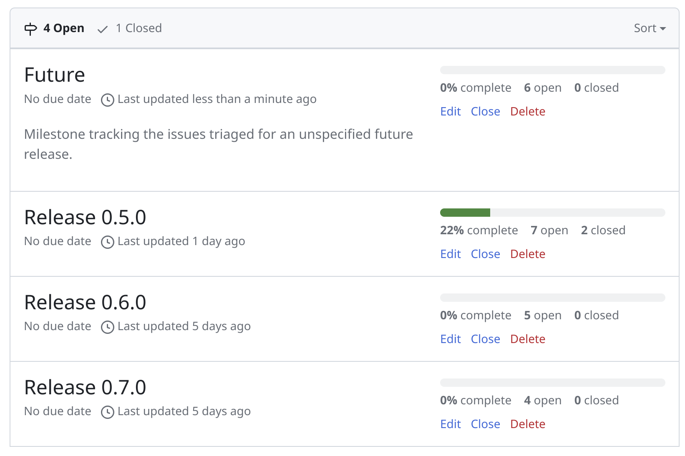

Over the past months,
we have been working hard on bringing Odra to the Casper world.
While we are proud of what we have achieved so far,
the hard part is just beginning.
Smart contract developers from outside of our team are starting to use Odra.
We are thrilled about it and here is how we are going to support the community.

<!--truncate-->

## Hello Odra Community

Whether you are a Rust developer, Solidity developer or a Casper enthusiast
we are happy to have you here, reading this blog post.

We have built Odra to make smart contract development on Casper easy.
Now we are entering the next phase of the open source journey.
We are going to focus on the community and make sure
Odra is the best tool for the job.
Our motto (we borrowed from the Django Project) is:

> **We bring cutting-edge smart contract development tools to 
professionals with deadlines.**

How will we do it? We are going to focus on four things:
- **Quality** - Our code and documentation will be of the highest quality.
We will always have tons of tests and examples.
- **Simplicity** - The simplest solution is the best solution.
Odra's API needs to be simple and easy to use.
Always!
We are not afraid to take a few steps back and rethink our design.
We believe in short feedback loops and fast iterations.
- **Reusability** - No one likes to repeat itself.
We see a huge potential in Odra Modules.
In time it can become a standard library of Casper smart contracts,
that are battle-tested and ready to use.
- **Community** - We are here to help you.
You can always reach out to us on [Discord] or [Github].

## We will help with your project

Whether you are a Rust developer or not, you can start using Odra today.
We have prepared a few [examples and docs] that will help you get started.
Rust knowledge required to use Odra is minimal.
That was always the goal.

But we understand that it is hard to start.
We got your back.

> **We offer free consulting + 2 hours of live coding.**

All you have to do is write us an email at **contract@odra.dev**
with a short description of your project.
We will schedule a call and help you get started with Odra.
After 2 hours of live coding, you will have a working repository with 2 or 3 
smart contracts, that you can use as a starting point for your project.

## Roadmap

The feedback we got quite often was:
__It's nice, but will it last? What's the direction of the project?__
Point taken. Now we answer: __We are here to stay.__
We got the support from the Casper Association and some projects of our own
to keep us funded. We play the long game.

To systematize our work we have prepared the [roadmap].
As of now we maintain plans for at least three future releases.
We think it is a good balance between predictability and flexibility.
We will release new versions approximately every 1-2 months or as needed.
Everyone is encouraged to propose a new Odra feature or enhancement.
New proposals need to be discussed and approved by the core team.
When the feature is ready, we assign it to the one of the future release.

[Discord]: https://discord.gg/Mm5ABc9P8k
[Github]: https://github.com/odradev/odra
[examples and docs]: https://odra.dev/docs
[roadmap]: https://github.com/odradev/odra/milestones
