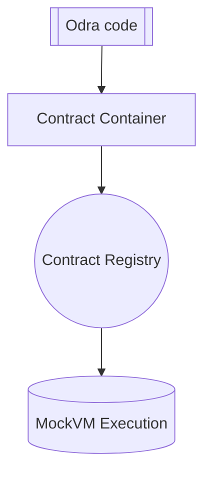

# MockVM

The MockVM is a simple implementation of a mock backend with a minimal set of features that allow testing
the code written in Odra without compiling the contract to the target architecture and spinning up the
blockchain.

Thanks to MockVM tests run a lot faster than other backends and debugging is a lot simpler.


## Usage
The MockVM is the default backend for Odra framework, so each time you run

```bash
cargo odra test
```

You are running your code against it.

## Architecture
MockVM consists of two main parts: the Contract Register and the State.

The Contract Register is just a list of contracts deployed onto the MockVm, identified by an address.
Each time we are calling the contract, we are calling its instance stored in the Contract Register.

Contracts and Test Env functions can modify the State of the MockVM.

Contrary to the "real" backend, which holds the whole history of the blockchain,
the MockVM State holds only the current state of the MockVM.
Thanks to this and the fact that we do not need the blockchain itself,
MockVM starts instantly and runs the tests in the native speed.

## Execution

When the MockVM backend is enabled, the `#[odra::module]` macro is responsible for converting
your `pub` functions into a list of Entrypoints, which are put into a Contract Container.
When the contract is deployed, its Container registered into a Registry under an address.
During the contract call, MockVM finds an Entrypoint and executes the code.

