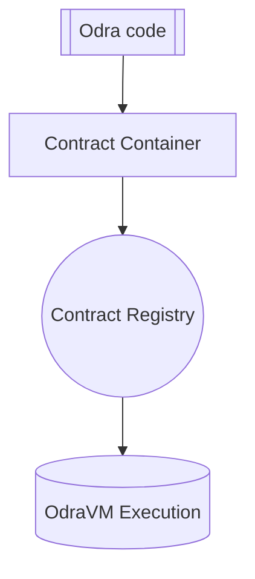

# OdraVM

The OdraVM is a simple implementation of a mock backend with a minimal set of features that allows testing
the code written in Odra without compiling the contract to the target architecture and spinning up the
blockchain.

Thanks to OdraVM tests run a lot faster than other backends. You can even debug the code in real time -
simply use your IDE's debug functionality.

## Usage
The OdraVM is the default backend for Odra framework, so each time you run

```bash
cargo odra test
```

You are running your code against it.

## Architecture
OdraVM consists of two main parts: the `Contract Register` and the `State`.

The `Contract Register` is a list of contracts deployed onto the OdraVM, identified by an `Address`.

Contracts and Test Env functions can modify the `State` of the OdraVM.

Contrary to the "real" backend, which holds the whole history of the blockchain,
the OdraVM `State` holds only the current state of the OdraVM.
Thanks to this and the fact that we do not need the blockchain itself,
OdraVM starts instantly and runs the tests in the native speed.

## Execution

When the OdraVM backend is enabled, the `#[odra::module]` attribute is responsible for converting
your `pub` functions into a list of Entrypoints, which are put into a `Contract Container`.
When the contract is deployed, its Container registered into a Registry under an address.
During the contract call, OdraVM finds an Entrypoint and executes the code.



## Reverts

A call that reverts is rolled back as a whole, as on Casper: the storage and balances it changed,
contracts it deployed (also factory children), the new code of a failed `upgrade` - the old version
keeps running - and the events and native events it emitted, including those of nested calls. Event
counts, `get_event` indices and `last_call()` never see them.

Two things are still simpler than on Casper: a plain Rust panic in a contract (an `unwrap()` on
`None`, not a revert) rolls nothing back, and a reverted deploy still uses up an address.

The output of a revert is compact - the error and the call stack that led to it. Any other panic, an
assertion failure in a test or an `unwrap()` in contract code, prints the standard Rust message
(with `RUST_BACKTRACE` support), and a panic hook you install yourself keeps working.
