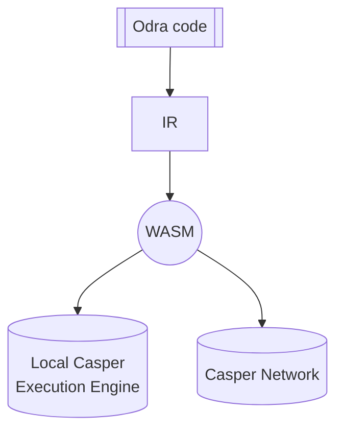

# CasperVM
The CasperVM backend allows you to compile your contracts into WASM files which can be deployed
onto [Casper Blockchain](https://casper.network/)
and lets you to easily run them against Casper's Execution Engine locally.

## Usage
Name of the Casper backend in Odra is `casper`, so to run the tests against it, simply pass it as a `-b`
parameter:

```bash
cargo odra test -b casper
```

## Execution

First thing Odra does with your code, is similar to the one used in [MockVM](02-mock-vm.md) - 
a list of entrypoints is generated, thanks to the `#[odra::module]` macro.

