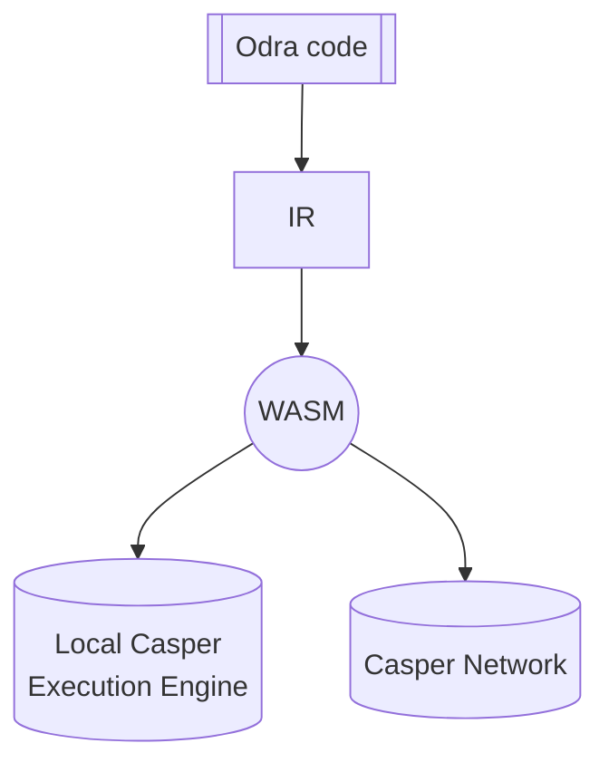

# Casper
The Casper backend allows you to compile your contracts into WASM files which can be deployed
onto [Casper Blockchain](https://casper.network/)
and lets you to easily run them against [Casper's Execution Engine][casper_engine] locally.

## Types

A struct to be written into the storage must implement `OdraType` which is defined as follow:

```rust
pub trait OdraType: 
    casper_types::CLTyped + 
    casper_types::bytesrepr::ToBytes + 
    casper_types::bytesrepr::FromBytes {}
```

The other exposed types are:

* `CallArgs` - wraps around casper's [`RuntimeArgs`][runtime_args];
* `Balance` - U512 type alias;
* `Address` - an enum that encapsulates casper's [`AccountHash`][account_hash] and [`ContractPackageHash`][contract_package_hash]

## Contract Env

As with any other backend, Casper Backend must implement the same features, but some do not have native support. Let's take a closer look at how Odra overcomes these hindrances.

### Events
An event is not a first-class citizen in Casper like in Ethereum, so Odra mimics it. As you've
already learned from the [events article](../basics/09-events.md), in Odra you emit an event, similarly, you would do it in [Solidity][events_sol].

Under the hood, Odra integrates with [Casper Event Standard] and creates a few [`URef`s][uref] in the global state when a contract is being installed:
1. `__events` - a dictionary that stores events' data.
2. `__events_length` - the evens count.
3. `__events_ces_version` - the version of `Casper Event Standard`. 
4. `__events_schema` -  a dictionary that stores event schemas.
   
Besides that, all the events the contract emits are registered - events schemas are written to the storage under the `__events_schema` key.

So, `Events` are nothing different from any other data stored by a contract.

A struct to be an event must implement traits defined by [Casper Event Standard], thankfully you can derive them using `#[derive(Event)]`.

### Payable
The first Odra idiom is a `Contract Main Purse`. It is a purse associated with a contract. The purse is created lazily - when the first transfer to the contract occurs, a proper `URef` and a purse are created and stored under the `__contract_main_purse` key.

Casper does not allow direct transfers from an account to a contract, so Odra comes up with the second idiom - a `Cargo Purse`. It is a one-time-use purse proxy between an account and a contract. First, motes go from the account to the cargo purse and then to the contract's main purse.

Behind the scenes, Odra handles an account-contract transfer via a cargo purse when a function is marked as payable.
If under the way something goes wrong with the transfer, the contract reverts.

The transferred amount can be read inside the contract by calling `self.env().attached_value()`.

:::note
Odra expects the `cargo_purse` runtime argument to be attached to a contract call.
In case of its absence, the `contract_env::attached_value()` returns zero.
:::

### Revert
In Casper, we can stop the execution pretty straightforwardly - call the `runtime::revert()`. 
Odra adds an extra abstraction layer - in a contract `ExecutionError`s are defined, which ultimately are transformed into Casper's [`ApiError::User`][api_error].

### Context
Casper equips developers with very low-level tooling, which can be cumbersome for newcomers.
If you want to check who called the contract or its address, you can not do it off-hand - you must analyze the call stack.

The `self.env().self_address()` function takes the first element of the callstack ([`runtime::get_call_stack()`][callstack]) and casts it to `Address`.

The `self.env().caller()` function takes the second element of the call stack (`runtime::get_call_stack()`) and casts it to `Address`.

As mentioned in the [Payable] section, to store CSPR, each contract creates its purse. To read the contract balance,
you call `self.env().self_balance()`, which checks the balance of the purse stored under `__contract_main_purse`.

## Test Env
Test environment allows you to test wasm contracts before you deploy them onto the testnet or livenet. It is built on top of the `Casper Execution Engine`.

In your test, you can freely switch execution context by setting as a caller (`test_env::set_caller()`) one of the 20 predefined accounts. Each account possesses the default amount of `Motes` (100_000_000_000_000_000).

The Test Env internally keeps track of the current `block time`, `error` and `attached value`.

Each test is executed on a fresh instance of the Test Env.

## Usage
Name of the Casper backend in Odra is `casper`, so to run the tests against it, simply pass it as a `-b`
parameter:

```bash
cargo odra test -b casper
```

If you want to just generate a wasm file, simply run:

```bash
cargo odra build -b casper
```

## Deploying a contract to Casper network

There would be no point in writing a contract if you couldn't deploy it to the blockchain.
You can do it in two ways: provided by the Casper itself: using the `casper-client` tool
or using the Odra's Livenet integration.

Let's explore the first option to better understand the process.

:::note
If you wish, you can skip the following section and jump to the [Livenet integration](04-livenet.md).
:::

### WASM arguments

When deploying a new contract you can pass some arguments to it.
Every contract written in Odra expects those arguments to be set:

- `odra_cfg_package_hash_key_name` - `String` type. The key under which the package hash of the contract will be stored.
- `odra_cfg_allow_key_override` - `Bool` type. If `true` and the key specified in `odra_cfg_package_hash_key_name` already exists, it will be overwritten.
- `odra_cfg_is_upgradable` - `Bool` type. If `true`, the contract will be deployed as upgradable.

Additionally, if required by the contract, you can pass constructor arguments.

When working with the test env via `cargo odra` or when using
[Livenet integration](04-livenet.md) this is handled automatically. However, if you rather use
`casper-client` directly, you have to pass them manually:

### Example: Deploy Counter

To deploy your contract with a constructor using `casper-client`, you need to pass the above arguments.
Additionally, you need to pass the `value` argument, which sets the arbitrary initial value for the counter.

```bash
casper-client put-deploy \
  --node-address [NODE_ADDRESS] \
  --chain-name casper-test \
  --secret-key [PATH_TO_YOUR_KEY]/secret_key.pem \
  --payment-amount 5000000000000 \
  --session-path ./wasm/counter.wasm \
  --session-arg "odra_cfg_package_hash_key_name:string:'counter_package_hash'" \
  --session-arg "odra_cfg_allow_key_override:bool:'true'" \
  --session-arg "odra_cfg_is_upgradable:bool:'true'" \
  --session-arg "value:u32:42" 
```

For a more in-depth tutorial, please refer to the [Casper's 'Writing On-Chain Code'].

### Example: Deploy ERC721

Odra comes with a standard ERC721 token implementation.
Clone the main Odra repo and navigate to the `modules` directory.

Firstly contract needs to be compiled.
```bash
cargo odra build -b casper -c erc721_token
```

It produces the `erc721_token.wasm` file in the `wasm` directory.

Now it's time to deploy the contract.
```bash
casper-client put-deploy \
  --node-address [NODE_ADDRESS] \
  --chain-name casper-test \
  --secret-key [PATH_TO_YOUR_KEY]/secret_key.pem \
  --payment-amount 300000000000 \
  --session-path ./wasm/erc721_token.wasm \
  --session-arg "odra_cfg_package_hash_key_name:string:'my_nft'" \
  --session-arg "odra_cfg_allow_key_override:bool:'false'" \
  --session-arg "odra_cfg_is_upgradable:bool:'true'" \
  --session-arg "name:string:'MyNFT'" \
  --session-arg "symbol:string:'NFT'" \
  --session-arg "base_uri:string:'https://example.com/'"
```

It's done.
The contract is deployed and ready to use.
Your account is the owner of the contract and you can mint and burn tokens.
For more details see the code of the [ERC721] module.

To obtain the package hash of the contract search for `my_nft` key
in your account's named keys.

### Example: Deploy ERC1155

The process is similar to the one described in the previous section.

Contract compilation:
```bash
cargo odra build -b casper -c erc1155_token
```

Contract deployment:
```bash
casper-client put-deploy \
  --node-address [NODE_ADDRESS] \
  --chain-name casper-test \
  --secret-key [PATH_TO_YOUR_KEY]/secret_key.pem \
  --payment-amount 300000000000 \
  --session-path ./wasm/erc1155_token.wasm \
  --session-arg "odra_cfg_package_hash_key_name:string:'my_tokens'" \
  --session-arg "odra_cfg_allow_key_override:bool:'false'" \
  --session-arg "odra_cfg_is_upgradable:bool:'true'" \
  --session-arg "odra_cfg_constructor:string:'init'" \
```

As previously, your account is the owner and can mint and burn tokens.
For more details see the code of the [ERC1155] module.

## Sending CSPR to a contract

Defining payable entry points is described in [Native Token](../basics/12-native-token.md) section.

What is happening under the hood is that Odra creates a new `cargo_purse` argument for each payable
entry point. The `cargo_purse` needs to be top-upped with CSPR before calling the contract.
When a contract adds CSPR to another contract call, Odra handles it for you.
The problem arises when you want to call an entry point and attach CSPR as an account.
The only way of doing that is by executing code in the sessions context, that
top-ups the `cargo_purse` and then calls the contract.

Odra provides a generic `proxy_caller.wasm` that does exactly that.
You can build it by yourself from the main Odra repository, or use the [proxy_caller.wasm]
we maintain.

### Using proxy_caller.wasm

To use the `proxy_caller.wasm` you need to attach the following arguments:

- `contract_package_hash` - `BytesArray(32)` type. The package hash of the contract you want to call.
Result of `to_bytes` on [CasperPackageHash].
- `entry_point` - `String` type. The name of the entry point you want to call.
- `args` - `Bytes` type. It is a serialized [RuntimeArgs] with the arguments you want to pass
to the entry point. To be specific it is the result of `to_bytes` method wrapped with [Bytes] type.
- `attached_value`. `U512` type. The amount of CSPR you want to attach to the call.
- `amount`. `U512` type. Should be the same value as `attached_value` if not `None`.
It is a special Casper argument that enables the access to account's main purse.

Currently `casper-client` doesn't allow building such arguments.
You have to build it using your SDK.

## Execution

First thing Odra does with your code, is similar to the one used in [OdraVM](02-mock-vm.md) - 
a list of entrypoints is generated, thanks to the `#[odra::module]` macro.



[casper_engine]: https://crates.io/crates/casper-execution-engine
[events_sol]: https://docs.soliditylang.org/en/v0.8.15/contracts.html#example
[uref]: https://docs.rs/casper-types/latest/casper_types/struct.URef.html
[callstack]: https://docs.rs/casper-contract/latest/casper_contract/contract_api/runtime/fn.get_call_stack.html
[runtime_args]: https://docs.rs/casper-types/latest/casper_types/runtime_args/struct.RuntimeArgs.html
[account_hash]: https://docs.rs/casper-types/latest/casper_types/account/struct.AccountHash.html
[contract_package_hash]: https://docs.rs/casper-types/latest/casper_types/struct.ContractPackageHash.html
[api_error]: https://docs.rs/casper-types/latest/casper_types/enum.ApiError.html
[deploy]: https://docs.rs/casper-execution-engine/latest/casper_execution_engine/core/engine_state/deploy_item/struct.DeployItem.html
[Casper Event Standard]: https://github.com/make-software/casper-event-standard
[Casper's 'Writing On-Chain Code']: https://docs.casper.network/writing-contracts/
[proxy_caller.wasm]: https://github.com/odradev/odra/blob/release/0.8.0/odra-casper/test-vm/resources/proxy_caller.wasm
[CasperPackageHash]: https://docs.rs/casper-types/latest/casper_types/contracts/struct.ContractPackageHash.html
[RuntimeArgs]: https://docs.rs/casper-types/latest/casper_types/runtime_args/struct.RuntimeArgs.html
[Bytes]: https://docs.rs/casper-types/latest/casper_types/bytesrepr/struct.Bytes.html
[ERC721]: https://github.com/odradev/odra/blob/release/0.8.0/modules/src/erc721_token.rs
[ERC1155]: https://github.com/odradev/odra/blob/release/0.8.0/modules/src/erc1155_token.rs