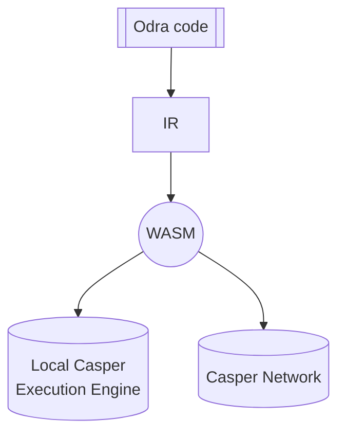

# Casper
The Casper backend allows you to compile your contracts into WASM files which can be deployed
onto [Casper Blockchain](https://casper.network/)
and lets you to easily run them against [Casper's Execution Engine][casper_engine] locally.

## Types

A struct to be written into the storage must implement `OdraType` which is defined as follow:

```rust
pub trait OdraType: 
    casper_types::CLTyped + 
    casper_types::bytesrepr::ToBytes + 
    casper_types::bytesrepr::FromBytes {}
```

The other exposed types are:

* `CallArgs` - wraps around casper's [`RuntimeArgs`][runtime_args];
* `Balance` - U512 type alias;
* `BlockTime` - u64 type alias;
* `Address` - an enum that encapsulates casper's [`AccountHash`][account_hash] and [`ContractPackageHash`][contract_package_hash]

## Contract Env

As with any other backend, Casper Backend must implement the same features, but some do not have native support. Let's take a closer look at how Odra overcomes these hindrances.

### Events
An event is not a first-class citizen in Casper like in Ethereum, so Odra mimics it. As you've
already learned from the [events article](../basics/09-events.md), in Odra you emit an event, similarly, you would do it in [Solidity][events_sol].

Under the hood, Odra integrates with [Casper Event Standard] and creates a few [`URef`s][uref] in the global state when a contract is being installed:
1. `__events` - a dictionary that stores events' data.
2. `__events_length` - the evens count.
3. `__events_ces_version` - the version of `Casper Event Standard`. 
4. `__events_schema` -  a dictionary that stores event schemas.
   
Besides that, all the events the contract emits are registered - events schemas are written to the storage under the `__events_schema` key.

:::note
Don't forget to expose events in the module using `#[odra::module(events = [...])]`. 
:::

So, `Events` are nothing different from any other data stored by a contract.

A struct to be an event must implement `SerializableEvent` which is defined as follow:

```rust
pub trait SerializableEvent: 
    odra_types::event::OdraEvent + 
    casper_types::CLTyped + 
    casper_types::bytesrepr::ToBytes + 
    casper_types::bytesrepr::FromBytes {}
```

### Payable
The first Odra idiom is a `Contract Main Purse`. It is a purse associated with a contract. The purse is created lazily - when the first transfer to the contract occurs, a proper `URef` and a purse are created and stored under the `__contract_main_purse` key.

Casper does not allow direct transfers from an account to a contract, so Odra comes up with the second idiom - a `Cargo Purse`. It is a one-time-use purse proxy between an account and a contract. First, motes go from the account to the cargo purse and then to the contract's main purse.

Behind the scenes, Odra handles an account-contract transfer via a cargo purse when a function is marked as payable.
If under the way something goes wrong with the transfer, the contract reverts.

The transferred amount can be read inside the contract by calling `contract_env::attached_value()`.

:::note
Odra expects the `cargo_purse` runtime argument to be attached to a contract call.
:::

### Revert
In Casper, we can stop the execution pretty straightforwardly - call the `runtime::revert()`. 
Odra adds an extra abstraction layer - in a contract `ExecutionError`s are defined, which ultimately are transformed into Casper's [`ApiError::User`][api_error].

### Context
Casper equips developers with very low-level tooling, which can be cumbersome for newcomers.
If you want to check who called the contract or its address, you can not do it off-hand - you must analyze the call stack.

The `contract_env::self_address()` function takes the first element of the callstack ([`runtime::get_call_stack()`][callstack]) and casts it to `Address`.

The `contract_env::caller()` function takes the second element of the call stack (`runtime::get_call_stack()`) and casts it to `Address`.

As mentioned in the [Payable] section, to store CSPR, each contract creates its purse. To read the contract balance, you call `contract_env::self_balance`, which checks the balance of the purse stored under `__contract_main_purse`.

## Test Env
Test environment allows you to test wasm contracts before you deploy them onto the testnet or livenet. It is built on top of the `Casper Execution Engine`.

In your test, you can freely switch execution context by setting as a caller (`test_env::set_caller()`) one of the 20 predefined accounts. Each account possesses the default amount of `Motes` (100_000_000_000_000_000).

The Test Env internally keeps track of the current `block time`, `error` and `attached value`.

Each test is executed on a fresh instance of the Test Env.

## Usage
Name of the Casper backend in Odra is `casper`, so to run the tests against it, simply pass it as a `-b`
parameter:

```bash
cargo odra test -b casper
```

If you want to just generate a wasm file, simply run:

```bash
cargo odra build -b casper
```

## Constructors

Let's define a basic Odra module that includes a constructor:


```rust
#[odra::module]
struct Counter {
    value: Variable<u32>
}

#[odra::module]
impl Counter {
    #[odra(init)]
    pub initialize(&mut self, value: u32) {
        self.value.set(value);
    }
}
```
Read more about constructors [here](../advanced/04-attributes.md#init).

To deploy your contract with a constructor using `casper-client`, you need to pass the `constructor` argument with a value of `initialize`  - this represents the name of the constructor function. Additionally, you need to pass the `value` argument, which sets the arbitrary initial value for the counter.

```
casper-client put-deploy \
  --node-address [NODE_ADDRESS] \
  --chain-name casper-test \
  --secret-key [PATH_TO_YOUR_KEY]/secret_key.pem \
  --payment-amount 5000000000000 \
  --session-path ./wasm/counter.wasm \
  --session-arg "constructor:string:'initialize'" \
  --session-arg "value:u32:42" 
```

For a more in-depth tutorial, please refer to the [Casper's 'Writing On-Chain Code'].

## Execution

First thing Odra does with your code, is similar to the one used in [MockVM](02-mock-vm.md) - 
a list of entrypoints is generated, thanks to the `#[odra::module]` macro.



[casper_engine]: https://crates.io/crates/casper-execution-engine
[events_sol]: https://docs.soliditylang.org/en/v0.8.15/contracts.html#example
[uref]: https://docs.rs/casper-types/latest/casper_types/struct.URef.html
[callstack]: https://docs.rs/casper-contract/latest/casper_contract/contract_api/runtime/fn.get_call_stack.html
[runtime_args]: https://docs.rs/casper-types/latest/casper_types/runtime_args/struct.RuntimeArgs.html
[account_hash]: https://docs.rs/casper-types/latest/casper_types/account/struct.AccountHash.html
[contract_package_hash]: https://docs.rs/casper-types/latest/casper_types/struct.ContractPackageHash.html
[api_error]: https://docs.rs/casper-types/latest/casper_types/enum.ApiError.html
[deploy]: https://docs.rs/casper-execution-engine/latest/casper_execution_engine/core/engine_state/deploy_item/struct.DeployItem.html
[Casper's 'Writing On-Chain Code']: https://docs.casper.network/writing-contracts/