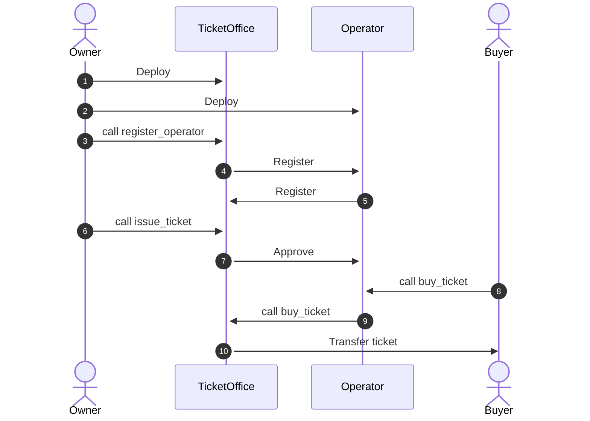

# Ticketing System
Non-fungible tokens (NFTs) are digital assets that represent ownership of unique items or pieces of content. They are commonly used for digital art, collectibles, in-game items, and other unique assets. In this tutorial, we will create a simple ticketing system based on NFT tokens.

Our contract will adhere to the CEP-78 standard, which is the standard for NFTs on the Casper blockchain.

Learn more about the CEP-78 standard [here](https://github.com/casper-ecosystem/cep-78-enhanced-nft/tree/dev/docs).

### Ticket Office Contract

Our TicketOffice contract will include the following features:
* Compliance with the CEP-78 standard.
* Ownership functionality.
* Only the owner can issue new event tickets.
* Users can purchase tickets for events.
* Tickets are limited to a one-time sale.
* Public access to view the total income of the `TicketOffice`.

### Setup the project

Creating a new NFT token with Odra is straightforward. Use the `cargo odra new` command to create a new project with the CEP-78 template:

```bash
cargo odra new --name ticket-office --template cep78
```

### Contract implementation

Let's start implementing the `TicketOffice` contract by modify the code generated from the template. 

```rust showLineNumbers title="src/token.rs"
use odra::{
    args::Maybe, casper_types::U512, prelude::*, Address, Mapping, SubModule, UnwrapOrRevert
};
use odra_modules::access::Ownable;
use odra_modules::cep78::{
    modalities::{MetadataMutability, NFTIdentifierMode, NFTKind, NFTMetadataKind, OwnershipMode},
    token::Cep78,
};

pub type TicketId = u64;

#[odra::odra_type]
pub enum TicketStatus {
    Available,
    Sold,
}

#[odra::odra_type]
pub struct TicketInfo {
    event_name: String,
    price: U512,
    status: TicketStatus,
}

#[odra::event]
pub struct OnTicketIssue {
    ticket_id: TicketId,
    event_name: String,
    price: U512,
}

#[odra::event]
pub struct OnTicketSell {
    ticket_id: TicketId,
    buyer: Address,
}

#[odra::odra_error]
pub enum Error {
    TicketNotAvailableForSale = 200,
    InsufficientFunds = 201,
    InvalidTicketId = 202,
    TicketDoesNotExist = 203,
}

#[odra::module(
    events = [OnTicketIssue, OnTicketSell],
    errors = Error
)]
pub struct TicketOffice {
    token: SubModule<Cep78>,
    ownable: SubModule<Ownable>,
    tickets: Mapping<TicketId, TicketInfo>,
}

#[odra::module]
impl TicketOffice {
    pub fn init(&mut self, collection_name: String, collection_symbol: String, total_supply: u64) {
        self.ownable.init();
        let receipt_name = format!("cep78_{}", collection_name);
        self.token.init(
            collection_name,
            collection_symbol,
            total_supply,
            OwnershipMode::Transferable,
            NFTKind::Digital,
            NFTIdentifierMode::Ordinal,
            NFTMetadataKind::Raw,
            MetadataMutability::Immutable,
            receipt_name,
            // remaining args are optional and can set to Maybe::None
            ...
        );
    }

    pub fn issue_ticket(&mut self, event_name: String, price: U512) {
        let env = self.env();
        let caller = env.caller();
        self.ownable.assert_owner(&caller);
        // mint a new token
        let (_, _, token_id) = self.token.mint(caller, "".to_string(), Maybe::None);
        let ticket_id: u64 = token_id
            .parse()
            .map_err(|_| Error::InvalidTicketId)
            .unwrap_or_revert(&env);
        // store ticket info
        self.tickets.set(
            &ticket_id,
            TicketInfo {
                event_name: event_name.clone(),
                price,
                status: TicketStatus::Available,
            },
        );
        // emit an event
        env.emit_event(OnTicketIssue {
            ticket_id,
            event_name,
            price,
        });
    }

    #[odra(payable)]
    pub fn buy_ticket(&mut self, ticket_id: TicketId) {
        let env = self.env();
        let owner = self.ownable.get_owner();
        let buyer = env.caller();
        let value = env.attached_value();
        // only tokens owned by the owner can be sold
        if self.token.owner_of(Maybe::Some(ticket_id), Maybe::None) != owner {
            env.revert(Error::TicketNotAvailableForSale);
        }
        let mut ticket = self
            .tickets
            .get(&ticket_id)
            .unwrap_or_revert_with(&env, Error::TicketDoesNotExist);
        // only available tickets can be sold
        if ticket.status != TicketStatus::Available {
            env.revert(Error::TicketNotAvailableForSale);
        }
        // check if the buyer sends enough funds
        if value < ticket.price {
            env.revert(Error::InsufficientFunds);
        }
        // transfer csprs to the owner
        env.transfer_tokens(&owner, &value);
        // transfer the ticket to the buyer
        self.token
            .transfer(Maybe::Some(ticket_id), Maybe::None, owner, buyer);
        ticket.status = TicketStatus::Sold;
        self.tickets.set(&ticket_id, ticket);

        env.emit_event(OnTicketSell { ticket_id, buyer });
    }

    pub fn balance_of(&self) -> U512 {
        self.env().self_balance()
    }
}
```
* **L10-L44** - We define structures and enums that will be used in our contract. `TicketStatus` enum represents the status of a ticket, `TicketInfo` struct contains information about a ticket that is written to the storage, `TicketId` is a type alias for `u64`. `OnTicketIssue` and `OnTicketSell` are events that will be emitted when a ticket is issued or sold.
* **L46-L49** - Register errors and events that will be used in our contract, required to produce a complete contract schema.
* **L51-L53** - `TicketOffice` module definition. The module contains a `Cep78` token, an `Ownable` module, and a `Mapping` that stores information about tickets.
* **L58-L74** - The `init` function has been generated from the template and there is no need to modify it, except the `Ownable` module initialization.
* **L76-L94** - The `issue_ticket` function allows the owner to issue a new ticket. The function mints a new token, stores information about the ticket, and emits an `OnTicketIssue` event.
* **L103** - The `payable` attribute indicates that the `buy_ticket` function can receive funds.
* **L104-L134** - The `buy_ticket` function checks if the ticket is available for sale, if the buyer sends enough funds, and transfers the ticket to the buyer. Finally, the function updates the ticket status and emits an `OnTicketSell` event.

Lets test the contract. The test scenario will be as follows:
1. Deploy the contract.
2. Issue two tickets.
3. Try to buy a ticket with insufficient funds.
4. Buy tickets.
5. Try to buy the same ticket again.
6. Check the balance of the contract.

```rust showLineNumbers title="src/tests.rs"
use odra::{
    casper_types::U512,
    host::{Deployer, HostRef},
};

use crate::token::{Error, TicketOfficeHostRef, TicketOfficeInitArgs};

#[test]
fn it_works() {
    let env = odra_test::env();
    let init_args = TicketOfficeInitArgs {
        collection_name: "Ticket".to_string(),
        collection_symbol: "T".to_string(),
        total_supply: 100,
    };  
    let mut contract = TicketOffice::deploy(&env, init_args);
    contract.issue_ticket("Ev".to_string(), U512::from(100));
    contract.issue_ticket("Ev".to_string(), U512::from(50));

    let buyer = env.get_account(1);
    env.set_caller(buyer);

    assert_eq!(
        contract
            .with_tokens(U512::from(50))
            .try_buy_ticket(0),
        Err(Error::InsufficientFunds.into())
    );

    assert_eq!(
        contract
            .with_tokens(U512::from(100))
            .try_buy_ticket(0),
        Ok(())
    );
    assert_eq!(
        contract
            .with_tokens(U512::from(50))
            .try_buy_ticket(1),
        Ok(())
    );

    assert_eq!(
        contract
            .with_tokens(U512::from(100))
            .try_buy_ticket(0),
        Err(Error::TicketNotAvailableForSale.into())
    );
}
```

Unfortunately, the test failed. The first assertion succeeds because the buyer sends insufficient funds to buy the ticket. However, the second assertion fails even though the buyer sends enough funds to purchase the ticket. The buy_ticket function reverts with `Cep78Error::InvalidTokenOwner` because the buyer attempts to transfer a token that they do not own, are not approved for, or are not an operator of.

```rust title="odra/modules/src/cep78/token78.rs"
pub fn transfer(
    &mut self,
    token_id: Maybe<u64>,
    token_hash: Maybe<String>,
    source_key: Address,
    target_key: Address
) -> TransferReceipt {
    ...

    if !is_owner && !is_approved && !is_operator {
        self.revert(CEP78Error::InvalidTokenOwner);
    }

    ...
}
```

Let's fix it by redesigning our little system.

### Redesign

Since a buyer cannot purchase a ticket directly, we need to introduce an intermediary — an operator who will be responsible for buying tickets on behalf of the buyer. The operator will be approved by the ticket office to transfer tickets.

The sequence diagram below illustrates the new flow:


#### Ticket Operator Contract

As shown in the sequence diagram, a new contract will act as an operator for the ticket office. To create this new contract, use the `cargo odra generate` command.

```sh
cargo odra generate -c ticket_operator
```

```rust showLineNumbers title="src/ticket_operator.rs"
use crate::token::{TicketId, TicketOfficeContractRef};
use odra::{casper_types::U512, prelude::*, Address, UnwrapOrRevert, Var};

#[odra::odra_error]
pub enum Error {
    UnknownTicketOffice = 300,
}

#[odra::module(errors = Error)]
pub struct TicketOperator {
    ticket_office_address: Var<Address>,
}

#[odra::module]
impl TicketOperator {
    pub fn register(&mut self, ticket_office_address: Address) {
        self.ticket_office_address.set(ticket_office_address);
    }

    // now the operator's `buy_ticket` receives funds.
    #[odra(payable)]
    pub fn buy_ticket(&mut self, ticket_id: TicketId) {
        let env = self.env();
        let buyer = env.caller();
        let value = env.attached_value();
        let center = self
            .ticket_office_address
            .get()
            .unwrap_or_revert_with(&env, Error::UnknownTicketOffice);
        let mut ticket_contract = TicketOfficeContractRef::new(env, center);
        // now and approved entity - the operator - buys the ticket on behalf of the buyer
        ticket_contract.buy_ticket(ticket_id, buyer, value);
    }

    pub fn balance_of(&self) -> U512 {
        self.env().self_balance()
    }
}
```

* **L4-L7** - Define errors that will be used in the contract.
* **L9-L13** - Define the `TicketOperator` module that stores the address of the ticketing office.
* **L16-L18** - The `register` function sets the address of the ticketing office.
* **L20-L32** - The `buy_ticket` function buys a ticket on behalf of the buyer using the ticket office address. The function forwards the call to the ticketing office contract. We simply create a `TicketOfficeContractRef` to interact we the `TicketOffice` contract. Note that, the operator's `buy_ticket` now receives funds.


Now we need to adjust the `TicketOffice` contract to use the `TicketOperator` contract to buy tickets.

```rust showLineNumbers title="src/token.rs"
use odra::Var;

... 

#[odra::odra_error]
pub enum Error {
    ...
    MissingOperator = 204,
    Unauthorized = 205,
}

#[odra::module]
pub struct TicketOffice {
    ...
    operator: Var<Address>,
}

#[odra::module]
impl TicketOffice {
    ... 

    pub fn register_operator(&mut self, operator: Address) {
        // only the owner can register an operator
        let caller = self.env().caller();
        self.ownable.assert_owner(&caller);
        // store the ticketing center address in the operator contract
        TicketOperatorContractRef::new(self.env(), operator).register(self.env().self_address());
        self.operator.set(operator);
    }

    pub fn issue_ticket(&mut self, event_name: String, price: U512) {
        // minting logic remains the same...
        ...

        // approve the operator to transfer the ticket
        let operator = self.operator();
        self.token
            .approve(operator, Maybe::Some(ticket_id), Maybe::None);

        // emit an event
        ...
    }

    pub fn buy_ticket(&mut self, ticket_id: TicketId, buyer: Address, value: U512) {
        let env = self.env();
        let owner = self.ownable.get_owner();
        let caller = env.caller();
        // make sure the caller is the operator
        if !self.is_operator(caller) {
            env.revert(Error::Unauthorized);
        }

        ...
        // the logic remains the same, except for the csprs transfer
        // it is now handled by the operator contract.
        // env.transfer_tokens(&owner, &value);
    }

    #[inline]
    fn is_operator(&self, caller: Address) -> bool {
        Some(caller) == self.operator.get()
    }

    #[inline]
    fn operator(&self) -> Address {
        self.operator
            .get()
            .unwrap_or_revert_with(&self.env(), Error::MissingOperator)
    }
}
```
* **L15** - the contract stores the operator address.
* **L22-L29** - a new function `register_operator` allows the owner to register an operator. Also calls the `register` entry point on the operator contract.
* **L36-38** - modify the `issue_ticket` function: once a new token is minted, approves the operator to transfer the ticket later.
* **L44-L57** - modify the `buy_ticket` function: check if the caller is the operator, do not transfer cspr to the contract - now the operator collect funds.
* We also added two helper functions: `is_operator` and `operator` to check if the caller is the operator and get the operator address. Two new errors were added: `MissingOperator` and `Unauthorized`.

Now we need to update our tests to create a scenario we presented in the sequence diagram.

```rust showLineNumbers title="src/tests.rs"
use odra::{
    casper_types::U512,
    host::{Deployer, HostRef, NoArgs},
    OdraResult,
};

use crate::{
    ticket_operator::TicketOperatorHostRef,
    token::{Error, TicketId, TicketOfficeContractRef, TicketOfficeInitArgs},
};

#[test]
fn it_works() {
    let env = odra_test::env();
    let init_args = TicketOfficeInitArgs {
        collection_name: "Ticket".to_string(),
        collection_symbol: "T".to_string(),
        total_supply: 100,
    };
    let operator = TicketOperator::deploy(&env, NoArgs);
    let mut ticket_office = TicketOfficeContractRef::deploy(&env, init_args);
    ticket_office.register_operator(operator.address().clone());
    ticket_office.issue_ticket("Ev".to_string(), U512::from(100));
    ticket_office.issue_ticket("Ev".to_string(), U512::from(50));

    let buyer = env.get_account(1);
    env.set_caller(buyer);

    assert_eq!(
        buy_ticket(&operator, 0, 50),
        Err(Error::InsufficientFunds.into())
    );
    assert_eq!(buy_ticket(&operator, 0, 100), Ok(()));
    assert_eq!(buy_ticket(&operator, 1, 50), Ok(()));
    assert_eq!(
        buy_ticket(&operator, 0, 100),
        Err(Error::TicketNotAvailableForSale.into())
    );

    assert_eq!(operator.balance_of(), U512::from(150));
}

fn buy_ticket(operator: &TicketOperatorHostRef, id: TicketId, price: u64) -> OdraResult<()> {
    operator.with_tokens(U512::from(price)).try_buy_ticket(id)
}

```

### Conclusion

In this tutorial, we created a simple ticketing system using the CEP-78 standard. This guide demonstrates how to combine various Odra features, including modules, events, errors, payable functions, and cross-contract calls.