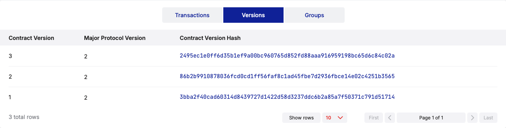

# Upgrading Contracts

This tutorial demonstrates how to upgrade a contract deployed on the Casper Livenet environment using Odra.
It is a continuation of the previous tutorial on [deploying contracts](./deploying-on-casper.md).
If you didn't follow the previous tutorial, please do so before continuing.


## Livenet Example

In this example, we will deploy a simple counter contract and then upgrade it to a new version with additional features.
We will skip the details of the contract implementation and focus on the deployment and upgrade process.

Our example deploys a simple counter contract making it upgradable and then upgrades it twice: first to `CounterV2`, and then back to `CounterV1`.

```rust title=examples/bin/upgrades_on_livenet.rs
//! This example demonstrates how to deploy and upgrade a contract on the Livenet environment.

use odra::casper_types::U256;
use odra::host::{Deployer, HostRef, InstallConfig, NoArgs};
use odra_examples::features::upgrade::{CounterV1, CounterV2, CounterV2UpgradeArgs};

fn main() {
    let env = odra_casper_livenet_env::env();

    env.set_gas(500_000_000_000u64);

    // Contracts can be upgraded
    let mut counter =
        CounterV1::deploy_with_cfg(&env, NoArgs, InstallConfig::upgradable::<CounterV1>());

    env.set_gas(50_000_000_000u64);
    counter.increment();
    assert_eq!(counter.get(), 1);

    env.set_gas(500_000_000_000u64);
    let mut counter2 = CounterV2::try_upgrade(
        &env,
        counter.contract_address(),
        CounterV2UpgradeArgs { new_start: None }
    )
    .unwrap();

    env.set_gas(50_000_000_000u64);
    counter2.increment();
    assert_eq!(counter2.get(), U256::from(2));

    env.set_gas(500_000_000_000u64);
    let mut counter3 = CounterV1::try_upgrade(&env, counter.contract_address(), NoArgs).unwrap();

    env.set_gas(50_000_000_000u64);
    counter3.increment();
    assert_eq!(counter3.get(), 2);
}
```

The `Deployer` trait has two functions that allow upgrading contracts:

- `try_upgrade`: upgrades a contract to a new version. It takes the environment, the address of the contract to be upgraded, and the arguments for the new version of the contract. The function 
- `try_upgrade_with_cfg`: same as `try_upgrade`, but allows specifying a custom [upgrade configuration].

Let's take a quick look at the `CounterV2` implementation:

```rust
#[odra::module]
impl CounterV2 {
    pub fn init(&mut self, start_from: Option<U256>) {
        if let Some(start) = start_from {
            self.new_counter.set(start);
        } else {
            self.new_counter.set(U256::from(0));
        }
    }

    pub fn upgrade(&mut self, new_start: Option<U256>) {
        if let Some(start) = new_start {
            self.new_counter.set(start);
        } else {
            // If no new value is provided, we keep the current value
            self.new_counter.set(self.counter.get_or_default().into());
        }
    }

    ...
}
```

The contract implements the `upgrade` function, which allows executing the upgrade logic for the contract. When upgrading to a new version, the `upgrade` function is called with the new initialization parameters. We call the `try_upgrade` function with `CounterV2UpgradeArgs` - a struct [automatically generated] by the Odra framework. It is a mirror feature of the contract's initialization parameters.

## Run the example

Now, let's see the code in action!

```bash
cargo run --bin our_token_livenet --features livenet
```

A sample output of the program might look like this:

```
    Finished `dev` profile [unoptimized + debuginfo] target(s) in 0.11s
     Running `../target/debug/upgrade_on_livenet`
💁  INFO : Found wasm under "/Users/kpob/workspace/odra/examples/wasm/CounterV1.wasm".
💁  INFO : Deploying "CounterV1".
🙄  WAIT : Waiting 10 for V1(TransactionV1Hash(301469239d731d7b7ca9aef7a42dcb1473a1388d59e1bac619a008e7b555aa0d)).
💁  INFO : Transaction "301469239d731d7b7ca9aef7a42dcb1473a1388d59e1bac619a008e7b555aa0d" successfully executed.
🔗  LINK : https://testnet.cspr.live/transaction/301469239d731d7b7ca9aef7a42dcb1473a1388d59e1bac619a008e7b555aa0d
💁  INFO : Contract "contract-package-b8b5003fe3ba05b4cae2e8acaeb777520e025958e12bd15394bf42e96f3f7b12" deployed.
💁  INFO : Calling "contract-package-b8b5003fe3ba05b4cae2e8acaeb777520e025958e12bd15394bf42e96f3f7b12" directly with entrypoint "increment".
🙄  WAIT : Waiting 10 for V1(TransactionV1Hash(a0fb180018063702094cdd66bdda1a3eda6f90c2e726334f202d77cddd88e649)).
🙄  WAIT : Waiting 10 for V1(TransactionV1Hash(a0fb180018063702094cdd66bdda1a3eda6f90c2e726334f202d77cddd88e649)).
💁  INFO : Transaction "a0fb180018063702094cdd66bdda1a3eda6f90c2e726334f202d77cddd88e649" successfully executed.
🔗  LINK : https://testnet.cspr.live/transaction/a0fb180018063702094cdd66bdda1a3eda6f90c2e726334f202d77cddd88e649
💁  INFO : Found wasm under "/Users/kpob/workspace/odra/examples/wasm/CounterV2.wasm".
💁  INFO : Deploying "CounterV2".
🙄  WAIT : Waiting 10 for V1(TransactionV1Hash(ec4518f51a2b3ed19886d6cd2d67e138aeb24834362d8fad8adb4af45fa36f21)).
💁  INFO : Transaction "ec4518f51a2b3ed19886d6cd2d67e138aeb24834362d8fad8adb4af45fa36f21" successfully executed.
🔗  LINK : https://testnet.cspr.live/transaction/ec4518f51a2b3ed19886d6cd2d67e138aeb24834362d8fad8adb4af45fa36f21
💁  INFO : Contract "contract-package-b8b5003fe3ba05b4cae2e8acaeb777520e025958e12bd15394bf42e96f3f7b12" deployed.
💁  INFO : Calling "contract-package-b8b5003fe3ba05b4cae2e8acaeb777520e025958e12bd15394bf42e96f3f7b12" directly with entrypoint "increment".
🙄  WAIT : Waiting 10 for V1(TransactionV1Hash(cc694727bf166c55e2080578fcf6dc944e2d9b931b8301fe5208c8e29e8c599a)).
🙄  WAIT : Waiting 10 for V1(TransactionV1Hash(cc694727bf166c55e2080578fcf6dc944e2d9b931b8301fe5208c8e29e8c599a)).
💁  INFO : Transaction "cc694727bf166c55e2080578fcf6dc944e2d9b931b8301fe5208c8e29e8c599a" successfully executed.
🔗  LINK : https://testnet.cspr.live/transaction/cc694727bf166c55e2080578fcf6dc944e2d9b931b8301fe5208c8e29e8c599a
💁  INFO : Found wasm under "/Users/kpob/workspace/odra/examples/wasm/CounterV1.wasm".
💁  INFO : Deploying "CounterV1".
🙄  WAIT : Waiting 10 for V1(TransactionV1Hash(58453efdf683f2271f558a22e406631edccff2771867069c2cbefb3386fc8833)).
💁  INFO : Transaction "58453efdf683f2271f558a22e406631edccff2771867069c2cbefb3386fc8833" successfully executed.
🔗  LINK : https://testnet.cspr.live/transaction/58453efdf683f2271f558a22e406631edccff2771867069c2cbefb3386fc8833
💁  INFO : Contract "contract-package-b8b5003fe3ba05b4cae2e8acaeb777520e025958e12bd15394bf42e96f3f7b12" deployed.
💁  INFO : Calling "contract-package-b8b5003fe3ba05b4cae2e8acaeb777520e025958e12bd15394bf42e96f3f7b12" directly with entrypoint "increment".
🙄  WAIT : Waiting 10 for V1(TransactionV1Hash(5cd3920e6b7cab505e074eb5684cc1b191841d2f24a889079d9fb1a92167fd4f)).
🙄  WAIT : Waiting 10 for V1(TransactionV1Hash(5cd3920e6b7cab505e074eb5684cc1b191841d2f24a889079d9fb1a92167fd4f)).
💁  INFO : Transaction "5cd3920e6b7cab505e074eb5684cc1b191841d2f24a889079d9fb1a92167fd4f" successfully executed.
🔗  LINK : https://testnet.cspr.live/transaction/5cd3920e6b7cab505e074eb5684cc1b191841d2f24a889079d9fb1a92167fd4f
```

## Cspr.live

Let's take a look at cspr.live: https://testnet.cspr.live/contract-package/b8b5003fe3ba05b4cae2e8acaeb777520e025958e12bd15394bf42e96f3f7b12

It works! Now our contracts has three versions deployed:



## Conclusion

In this tutorial, we learned how to upgrade a smart contract on the blockchain using the Odra framework. We deployed a simple counter contract, made it upgradable, and then upgraded it twice: first to `CounterV2`, and then back to `CounterV1`. We also explored the testnet to verify our contract deployments.

[upgrade configuration]: https://docs.rs/odra/2.3.0/odra/host/struct.UpgradeConfig.html
[automatically generated]: https://docs.rs/odra/2.3.0/odra/host/trait.UpgradeArgs.html