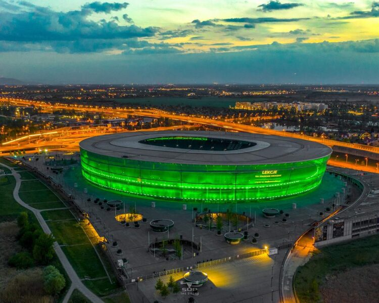
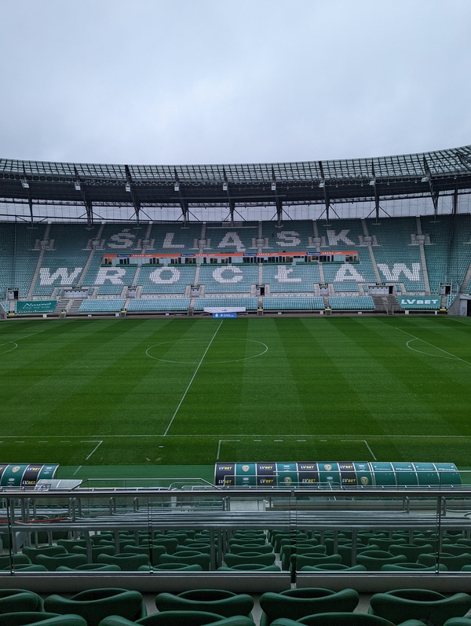

# Krypto Nad Odrą - Sponsor Sheet

## Who are we?
We come from the tech side of the blockchain space.

Maciej Zieliński - Software Engineer with 10+ years of experience in many fields. Now running a small blockchain-focused dev shop [odra.dev](https://odra.dev) in Wrocław. 

Piotr Dziubecki - Program Director at [Casper Blockchain](https://casper.network). 15+ years of Engineering and managing experience. Orchestrating the development at Casper and working on business development initiatives.

## Why do we do it?
Polish blockchain space is growing fast, and we want to consolidate Wrocław's (and national-wide) community. Traditionally Wrocław is tech-savvy, so the conference targets software engineers, rather than retail investors or NFT artists.

## Timeline
The date is yet to be defined, but it's most likely 30th September. The event lasts for 8 hours between 10 and 6 PM. Food and drinks are available.

## Lectures
The language of the conference is Polish.

The main theme of the event is "getting into blockchain development". We want experienced engineers to lecture on different parts of the tech stack. We feel that this is the most impactful approach we can take, and one that would meet the most interest.

Topics we want to cover:
- *101 of consensus in PoS systems.* - researcher story,
- *Dealing with the blockchain node.* - devops story.
- *Talking to the blockchain on the frontend.* - frontend dev story,
- *From zero to mainnet.* - blockchain core dev story,
- *That's embedded programming.* - smart contract dev story,
- *Blockchain-based project dynamics.* - project manager story,
- *Current trends in the blockchain space.* - the story.

These are still fluid and will be adjusted to speakers, but the idea is to keep talks in those bounds.

All the lectures will be recorded and available on YouTube after the event.

## Funding

### Costs
We estimated the costs to be between $30000 and $40000. This covers:
- event preparation and coordination,
- space at the Wrocław Stadium,
- social media coverage, before, during and after the event,
- event Swag (most likely good-quality t-shirts),
- event recording and post-processing,
- marketing materials and effort,
- free coffee + snack desk,
- free lunch (if we raise enough money).

### Tickets
All the attendees will need a named ticket. We plan to give away 100 tickets to sponsors, and partners, such as marketing in media, to university students and post-grads. Another 100 tickets we want to sell at some low amount (like $25) as a DOS fee, to have only those who are interested.

## Sponsors
Sponsors are those who make this event possible.

For __$2500__ we offer:
- Logo display on screens in the hall and in the conference room on the main screen with slides, between lectures.
- Logo on the main website.
- A promotional video materials distributed before the event. The proposed form is a short interview-like video. To be agreed with the sponsor.
- A booth.
- Tickets. The amount according to the needs.

For __$5000__ and more we offer:
- All of the above.
- Lecture slot for a talk that fits the conference theme. It needs to be discussed beforehand with us.

Each sponsor is required to sign the agreement.
Payment can be done before (preferred) or after the event.

## Wrocław Stadium
The event takes place at the [Wrocław Stadium](https://tarczynskiarenawroclaw.pl/). It has a good connection with the rest of the city and offers all the required infrastructure. That is:
- 200 people conference room,
- video recording capabilities,
- space for booths,
- space for food and drinks serving,
- security and cameras.

